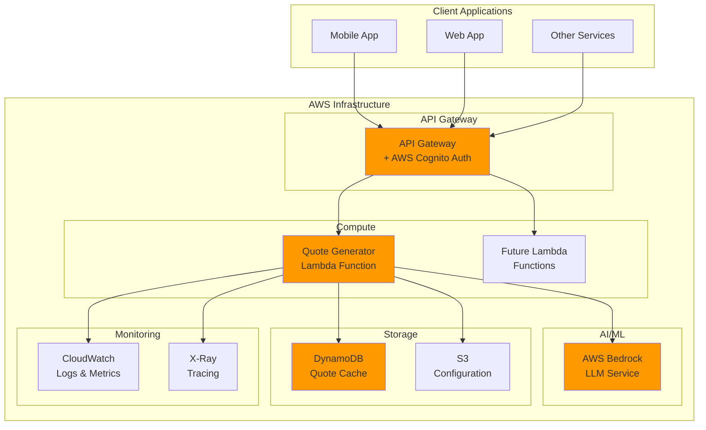
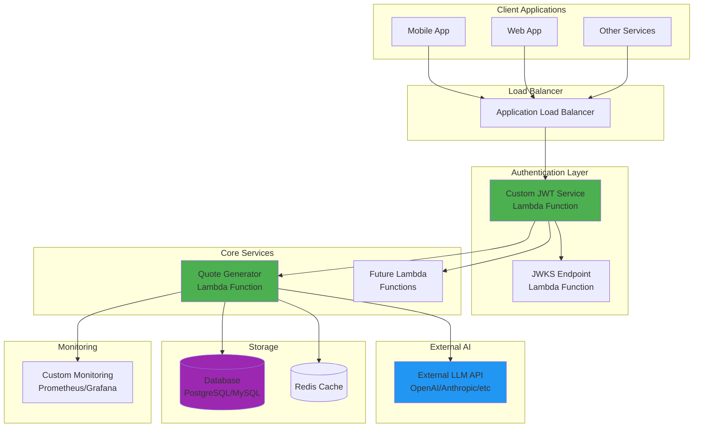

# Sloth Util

**AWS Lambda utilities for microservices** - A collection of reusable Lambda functions designed to provide common functionality across multiple applications.

## Overview

Sloth Util provides a suite of serverless utility functions deployed as AWS Lambda functions using Spring Boot Java. The functions are designed to be lightweight, reusable, and easily integrated into your existing microservices architecture.

### Current Features

- **Random Quote Generator**: Leverages AWS Bedrock LLM to generate inspirational, motivational, or contextual quotes on demand

### Planned Features

- Authentication utilities
- Data transformation functions
- Notification services
- File processing utilities

## Architecture

This project supports two deployment architectures to accommodate different organizational needs and requirements:

### Architecture 1: AWS-Native (Recommended)



**Benefits:**
- Fully managed authentication via AWS Cognito
- Seamless integration with AWS services
- Built-in monitoring and observability
- Cost-effective scaling
- Minimal operational overhead

### Architecture 2: Cloud-Agnostic with Custom JWT



**Benefits:**
- Cloud provider independence
- Custom authentication flow control
- Flexibility in LLM provider selection
- Portable across different environments
- Full control over security implementation

## Technology Stack

- **Runtime**: Java 17+ with Spring Boot 3.x
- **Build Tool**: Maven
- **Deployment**: SST (Serverless Stack) v3
- **Infrastructure**: AWS Lambda, API Gateway
- **AI/ML**: AWS Bedrock (Claude/Titan models)
- **Database**: DynamoDB (AWS) / PostgreSQL (Cloud-agnostic)
- **Authentication**: AWS Cognito / Custom JWT

## Cost Analysis

### Traffic Scenarios

| Scenario | Requests/Month | Concurrent Users | Peak RPS |
|----------|----------------|------------------|----------|
| **Low** | 100K | 10-50 | 5 |
| **Medium** | 1M | 100-500 | 50 |
| **High** | 10M | 1K-5K | 500 |

### AWS-Native Architecture Costs

| Component | Low Traffic | Medium Traffic | High Traffic |
|-----------|-------------|----------------|--------------|
| **Lambda Invocations** | $0.20 | $2.00 | $20.00 |
| **Lambda Duration** (1GB, 500ms avg) | $0.83 | $8.33 | $83.33 |
| **API Gateway** | $0.35 | $3.50 | $35.00 |
| **AWS Bedrock** (Claude Instant) | $15.00 | $150.00 | $1,500.00 |
| **DynamoDB** (On-Demand) | $2.50 | $12.50 | $62.50 |
| **CloudWatch Logs** | $0.50 | $2.50 | $12.50 |
| **Data Transfer** | $0.90 | $4.50 | $22.50 |
| **Total Monthly Cost** | **$19.28** | **$182.33** | **$1,735.83** |

### Cloud-Agnostic Architecture Costs

| Component | Low Traffic | Medium Traffic | High Traffic |
|-----------|-------------|----------------|--------------|
| **Lambda Functions** | $1.03 | $10.33 | $103.33 |
| **Application Load Balancer** | $16.20 | $16.20 | $16.20 |
| **External LLM API** (OpenAI GPT-3.5) | $20.00 | $200.00 | $2,000.00 |
| **PostgreSQL RDS** (t3.micro/medium/large) | $12.60 | $67.32 | $134.64 |
| **ElastiCache Redis** | $12.50 | $50.40 | $201.60 |
| **Data Transfer** | $0.90 | $5.40 | $27.00 |
| **Monitoring Stack** | $0.00 | $25.00 | $100.00 |
| **Total Monthly Cost** | **$63.23** | **$374.65** | **$2,582.77** |

### Cost Optimization Strategies

**AWS-Native:**
- Use provisioned concurrency for predictable workloads
- Implement intelligent caching with DynamoDB TTL
- Use Bedrock batch processing for bulk operations
- Enable CloudWatch log retention policies

**Cloud-Agnostic:**
- Implement aggressive caching strategies
- Use connection pooling for database connections
- Consider spot instances for non-critical workloads
- Optimize LLM API usage with prompt caching

## Getting Started

### Prerequisites

- Node.js 18+ (for SST)
- Java 17+
- Maven 3.8+
- AWS CLI configured (for AWS deployment)

### Installation

```bash
# Clone the repository
git clone https://github.com/klawed/sloth-util.git
cd sloth-util

# Install SST dependencies
npm install

# Build Java functions
mvn clean package

# Deploy to development environment
npx sst deploy --stage dev
```

### Configuration

Create a `.env` file in the project root:

```env
# AWS Configuration (for AWS-native architecture)
AWS_REGION=us-east-1
BEDROCK_MODEL_ID=anthropic.claude-instant-v1
COGNITO_USER_POOL_ID=your-user-pool-id

# Cloud-agnostic configuration
EXTERNAL_LLM_API_KEY=your-api-key
DATABASE_URL=your-database-url
REDIS_URL=your-redis-url
JWT_SECRET=your-jwt-secret
```

## API Endpoints

### Quote Generator

**GET** `/quotes/random`

Generate a random inspirational quote using AI.

**Query Parameters:**
- `category` (optional): Category of quote (motivational, tech, business, life)
- `length` (optional): Preferred length (short, medium, long)
- `cache` (optional): Use cached quotes if available (default: true)

**Response:**
```json
{
  "quote": "The best way to predict the future is to create it.",
  "author": "AI Generated",
  "category": "motivational",
  "timestamp": "2025-05-23T19:18:03Z",
  "cached": false
}
```

## Development

### Project Structure

```
sloth-util/
├── sst.config.ts              # SST configuration
├── packages/
│   ├── functions/             # Lambda function code
│   │   ├── quote-generator/
│   │   │   ├── src/main/java/
│   │   │   └── pom.xml
│   │   └── common/            # Shared utilities
│   ├── web/                   # Optional web interface
│   └── core/                  # Core business logic
├── stacks/                    # SST infrastructure stacks
├── scripts/                   # Deployment and utility scripts
└── docs/                      # Additional documentation
```

### Testing

```bash
# Run unit tests
mvn test

# Run integration tests
mvn verify

# Test local deployment
npx sst dev
```

## Deployment

### Development Environment

```bash
npx sst deploy --stage dev
```

### Production Environment

```bash
npx sst deploy --stage prod
```

### Environment-Specific Configuration

SST supports environment-specific configurations through stages. Each stage can have different:
- Infrastructure sizing
- Security policies
- Database configurations
- Monitoring levels

## Monitoring and Observability

### AWS-Native Architecture
- CloudWatch Logs and Metrics
- X-Ray distributed tracing
- Custom CloudWatch dashboards
- AWS Config for compliance

### Cloud-Agnostic Architecture
- Custom Prometheus metrics
- Grafana dashboards
- Structured logging with ELK stack
- Custom health check endpoints

## Contributing

1. Fork the repository
2. Create a feature branch (`git checkout -b feature/amazing-feature`)
3. Commit your changes (`git commit -m 'Add amazing feature'`)
4. Push to the branch (`git push origin feature/amazing-feature`)
5. Open a Pull Request

## Security

- All API endpoints require authentication
- Rate limiting implemented per client
- Input validation and sanitization
- Secrets managed through AWS Systems Manager Parameter Store
- Regular security dependency updates

## License

This project is licensed under the MIT License - see the [LICENSE](LICENSE) file for details.

## Roadmap

- [ ] Quote Generator Lambda (v1.0)
- [ ] Authentication utilities
- [ ] Image processing functions
- [ ] Email notification service
- [ ] Data validation utilities
- [ ] Rate limiting service
- [ ] Caching utilities
- [ ] Multi-language support

## Support

For support and questions:
- Create an issue in this repository
- Check the [documentation](docs/)
- Review existing issues and discussions

---

**Note**: This project is designed to be modular and extensible. Each Lambda function is independently deployable and can be used across different applications in your ecosystem.