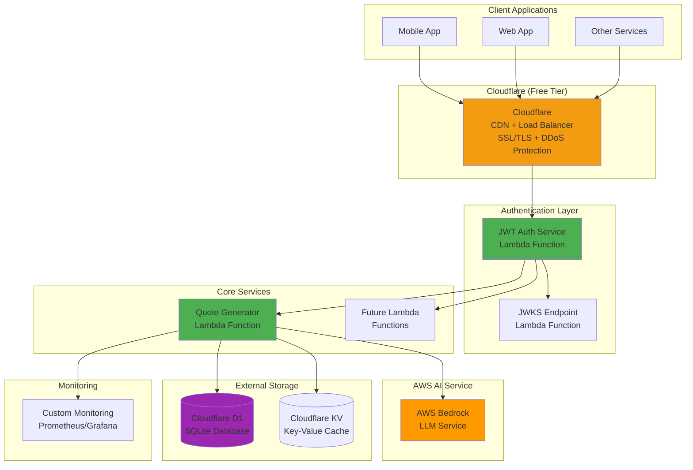

# Sloth Util

**Hybrid AWS Lambda utilities for microservices** - A collection of reusable Lambda functions designed to provide common functionality across multiple applications using external services and Cloudflare's free tier.

## 🚀 Quick Start

**1. Run the setup script:**
```bash
go run scripts/setup.go
```

**2. Start local services:**
```bash
docker-compose up -d
```

**3. Build and test:**
```bash
cd packages/functions
mvn clean install
```

**4. Deploy to development:**
```bash
npx sst dev
```

## Overview

Sloth Util provides a suite of serverless utility functions deployed as AWS Lambda functions using Spring Boot Java. The functions are designed to be lightweight, reusable, and easily integrated into your existing microservices architecture.

**✅ Now focusing exclusively on a Hybrid AWS + Cloudflare architecture** - uses Cloudflare D1, KV, and Cloudflare's free tier for optimal cost efficiency and vendor independence.

### Current Features

- **Random Quote Generator**: Leverages AWS Bedrock LLM to generate inspirational, motivational, or contextual quotes on demand
- **JWT Authentication Service**: Custom JWT-based authentication with Cloudflare D1 user management
- **JWKS Service**: JSON Web Key Set endpoint for public key distribution and JWT verification
- **Common Utilities**: Shared models, exception handling, and response utilities

### Planned Features

- Data transformation functions
- Notification services
- File processing utilities
- Multi-region deployment support

## Architecture

This project uses a **Hybrid architecture** to leverage AWS Lambda and Bedrock for compute and AI, while utilizing Cloudflare's free/cost-effective tier for CDN, security, and data storage (D1, KV) to optimize costs and avoid lock-in to AWS data services.



### Architecture Benefits

✅ **Cost Effective**: Uses Cloudflare free tier + Cloudflare D1 and KV  
✅ **Scalable**: Lambda functions scale automatically  
✅ **Maintainable**: Clean separation of concerns  
✅ **Testable**: Comprehensive testing setup with TestContainers  
✅ **Portable**: Not locked into AWS-specific services  
✅ **Secure**: Custom JWT implementation with full control

## Technology Stack

- **Runtime**: Java 17+ with Spring Boot 3.2
- **Build Tool**: Maven 3.8+
- **Deployment**: SST (Serverless Stack) v3
- **Infrastructure**: AWS Lambda with Function URLs
- **AI/ML**: AWS Bedrock (Claude/Titan models)
- **Database**: Cloudflare D1 (SQLite-based via API)
- **Cache**: Cloudflare KV (Key-Value store via API)
- **Authentication**: Custom JWT implementation
- **CDN/Load Balancer**: Cloudflare (free tier)
- **Testing**: JUnit 5 + TestContainers

## Cost Analysis
### AWS-Native Architecture Costs

| Component | Low Traffic | Medium Traffic | High Traffic |
|-----------|-------------|----------------|--------------|
| **Lambda Invocations** | $0.20 | $2.00 | $20.00 |
| **Lambda Duration** (1GB, 500ms avg) | $0.83 | $8.33 | $83.33 |
| **API Gateway** | $0.35 | $3.50 | $35.00 |
| **AWS Cognito** | $0.00 | $5.50 | $55.00 |
| **AWS Bedrock** (Claude Instant) | $15.00 | $150.00 | $1,500.00 |
| **RDS PostgreSQL** (t3.micro/small/medium) | $12.50 | $45.00 | $180.00 |
| **ElastiCache Redis** (t3.micro/small/medium) | $11.50 | $42.00 | $168.00 |
| **CloudWatch Logs** | $0.50 | $2.50 | $12.50 |
| **X-Ray Tracing** | $0.50 | $5.00 | $50.00 |
| **Data Transfer** | $0.90 | $4.50 | $22.50 |
| **Total Monthly Cost** | **$41.28** | **$268.33** | **$2,126.33** |

### Hybrid Architecture Costs

| Component | Low Traffic | Medium Traffic | High Traffic |
|-----------|-------------|----------------|--------------|
| **Lambda Invocations** | $0.20 | $2.00 | $20.00 |
| **Lambda Duration** (1GB, 500ms avg) | $0.83 | $8.33 | $83.33 |
| **Function URLs** (Free) | $0.00 | $0.00 | $0.00 |
| **Cloudflare Pro** | $5.00 | $5.00 | $5.00 |
| **AWS Bedrock** (Claude Instant) | $15.00 | $150.00 | $1,500.00 |
| **Cloudflare D1** (Database) | $0.00 | $5.00 | $25.00 |
| **Cloudflare KV** (Key-Value Store) | $0.00 | $2.50 | $15.00 |
| **CloudWatch Logs** | $0.50 | $2.50 | $12.50 |
| **Custom Monitoring** | $0.00 | $15.00 | $75.00 |
| **Data Transfer** | $0.90 | $4.50 | $22.50 |
| **Total Monthly Cost** | **$22.43** | **$194.83** | **$1,758.33** |

### Cost Comparison Summary

| Traffic Level | AWS-Native | Hybrid | Difference |
|---------------|------------|---------|------------|
| **Low** | $41.28 | $22.43 | -$18.85 (-46%) |
| **Medium** | $268.33 | $194.83 | -$73.50 (-27%) |
| **High** | $2,126.33 | $1,758.33 | -$368.00 (-17%) |

**Key Insights:**
- **Hybrid is actually cheaper** across all traffic levels
- Cloudflare's generous free tiers (D1, KV, CDN) provide significant cost savings
- Cost advantage increases at lower traffic volumes
- AWS-native has higher baseline costs due to RDS/ElastiCache minimums
- Hybrid eliminates vendor lock-in while being more cost-effective

**Hybrid Benefits:**
- **Lower costs** especially at low-medium traffic
- No vendor lock-in - can switch providers easily
- Cloudflare Pro includes enterprise-grade CDN, security, and performance
- D1 (SQLite-based) and KV storage scale seamlessly
- Simpler architecture without VPC complexity
- Better global performance with Cloudflare's edge network
## Local Development Environment

### Prerequisites

- **Java 17+** (Amazon Corretto recommended)
- **Maven 3.8+**
- **Node.js 18+** (for SST)
- **Docker & Docker Compose** (for local services)
- **AWS CLI** configured with appropriate permissions
- **Go 1.19+** (for setup scripts)

### Local Setup

```bash
# 1. Clone repository
git clone https://github.com/klawed/sloth-util.git
cd sloth-util

# 2. Setup project structure
go run scripts/setup.go

# 3. Install dependencies
npm install
cd packages/functions && mvn clean install && cd ../..

# 4. Configure environment
cp .env.example .env
# Edit .env with your configuration

# 5. Start local development services
docker-compose up -d

# 6. Start SST development mode
npx sst dev
```

### Local Development Stack

```yaml
# docker-compose.yml services
services:
  - LocalStack (AWS services simulation)
```

### Development Workflow

1. **Code Changes**: Edit Java functions in `packages/functions/`
2. **Hot Reload**: SST automatically rebuilds and redeploys on changes
3. **Local Testing**: Use local endpoints provided by `sst dev`
4. **Integration Tests**: Run against local Docker services
5. **Debug**: Attach debugger to running Lambda functions

### Environment Configuration

```bash
# .env.local (for local development)
STAGE=local
ARCHITECTURE_TYPE=hybrid # Changed
AWS_REGION=us-east-1
BEDROCK_MODEL_ID=anthropic.claude-instant-v1
JWT_SECRET=your-jwt-secret-key-min-32-chars
LOG_LEVEL=DEBUG

# Cloudflare specific (replace with your actual values/secrets)
CLOUDFLARE_API_TOKEN=your_cloudflare_api_token
CLOUDFLARE_ACCOUNT_ID=your_cloudflare_account_id
CLOUDFLARE_KV_NAMESPACE_ID_QUOTES=your_kv_namespace_id_for_quotes
# For D1, you might interact via a Worker URL
CLOUDFLARE_D1_WORKER_URL=your_d1_worker_url_if_any
CLOUDFLARE_D1_DATABASE_ID=your_d1_database_id # if using direct API
```

## CI/CD Pipeline

### GitHub Actions Workflow

The project uses GitHub Actions for continuous integration and deployment:

- **Automated Testing**: Unit tests, integration tests, security scans
- **Quality Checks**: SonarCloud code quality analysis
- **Development Deployment**: Auto-deploy on `develop` branch
- **Production Deployment**: Auto-deploy on `main` branch with approvals
- **Security**: Snyk vulnerability scanning

### Deployment Stages

1. **Development** (`develop` branch)
    - Automatic deployment on push
    - Full test suite execution
    - Integration with external services
    - Performance baseline testing

2. **Production** (`main` branch)
    - Automatic deployment on push
    - Comprehensive monitoring
    - Rollback capabilities

### Required GitHub Secrets

```bash
AWS_ACCESS_KEY_ID             # AWS deployment credentials
AWS_SECRET_ACCESS_KEY         # AWS deployment credentials
DEV_DATABASE_URL              # Development Cloudflare D1 connection
DEV_JWT_SECRET                # Development JWT secret
PROD_DATABASE_URL             # Production Cloudflare D1 connection
PROD_JWT_SECRET               # Production JWT secret
BEDROCK_MODEL_ID              # AWS Bedrock model identifier
SONAR_TOKEN                   # SonarCloud integration
SNYK_TOKEN                    # Security scanning
```

### Testing Strategy

```bash
# Unit Tests
mvn test

# Integration Tests (with TestContainers)
mvn verify -P integration-tests

# End-to-End Tests
npm run test:e2e

# Performance Tests
mvn test -P performance-tests

# Security Tests
npm run test:security
```

## Project Structure

```
sloth-util/
├── sst.config.ts                     # SST configuration (hybrid)
├── docker-compose.yml                # Local development services
├── packages/
│   ├── functions/                    # Lambda function code
│   │   ├── quote-generator/          # Quote generator service
│   │   │   └── src/main/java/com/slothutil/quotes/
│   │   │       ├── QuoteHandler.java
│   │   │       ├── config/
│   │   │       ├── service/
│   │   │       └── model/
│   │   ├── auth-service/             # JWT authentication service
│   │   ├── jwks-service/             # JWKS endpoint service
│   │   └── common/                   # Shared utilities
│   ├── core/                         # Core business logic
│   └── infrastructure/               # SST stack definitions
├── scripts/
│   ├── setup.go                      # Project setup script
│   ├── deploy.sh                     # Deployment scripts
│   └── test.sh                       # Testing scripts
├── .github/
│   └── workflows/
│        └── ci-cd.yml                # GitHub Actions pipeline
├── docs/                             # Additional documentation
└── tools/                            # Development tools and configs
```

## API Endpoints

### Quote Generator

**GET** `/quotes/random`

Generate a random inspirational quote using AI.

**Query Parameters:**
- `category` (optional): Category of quote (motivational, tech, business, life)
- `length` (optional): Preferred length (short, medium, long)
- `cache` (optional): Use cached quotes if available (default: true)

**Headers:**
- `Authorization: Bearer <jwt-token>` (for custom JWT auth)
- `Content-Type: application/json`

**Response:**
```json
{
  "quote": "The best way to predict the future is to create it.",
  "author": "AI Generated",
  "category": "motivational",
  "length": "short",
  "timestamp": "2025-05-23T19:18:03Z",
  "cached": false,
  "requestId": "req-123-456-789"
}
```

### Authentication

**POST** `/auth/login` - User authentication  
**POST** `/auth/refresh` - Token refresh  
**GET** `/.well-known/jwks.json` - JWKS public keys

## Monitoring and Observability

### Hybrid Monitoring
- Custom Prometheus metrics
- Grafana dashboards
- Structured logging with JSON format
- Custom health check endpoints
- Application performance monitoring
- CloudWatch logs (for Lambda functions)

## Security

- JWT-based authentication with custom implementation
- Rate limiting per client/IP (via Cloudflare)
- Input validation and sanitization
- Secrets managed securely via environment variables
- Regular security dependency updates
- OWASP compliance testing
- SSL/TLS termination via Cloudflare

## Getting Started

### Quick Setup

```bash
# 1. Clone repository
git clone https://github.com/klawed/sloth-util.git
cd sloth-util

# 2. Setup project structure
go run scripts/setup.go

# 3. Install dependencies
npm install
cd packages/functions && mvn clean install && cd ../..

# 4. Configure environment
cp .env.example .env
# Edit .env with your configuration

# 5. Start local development
docker-compose up -d
npx sst dev

# 6. Deploy to development
npx sst deploy --stage dev
```

## Contributing

1. Fork the repository
2. Create a feature branch (`git checkout -b feature/amazing-feature`)
3. Follow the coding standards (Checkstyle + SpotBugs)
4. Write tests for new functionality
5. Commit your changes (`git commit -m 'Add amazing feature'`)
6. Push to the branch (`git push origin feature/amazing-feature`)
7. Open a Pull Request

## License

This project is licensed under the MIT License - see the [LICENSE](LICENSE) file for details.

## Roadmap

- [x] Project setup and Hybrid architecture design
- [x] SpringBoot project structure with Go setup script
- [x] Complete Maven configuration with parent/child modules
- [x] Docker Compose for local development
- [x] CI/CD pipeline implementation
- [ ] Quote Generator Lambda implementation
- [ ] Custom JWT authentication service
- [ ] JWKS endpoint implementation
- [ ] Monitoring and alerting setup
- [ ] Performance optimization
- [ ] Additional utility functions
- [ ] Multi-region deployment support
- [ ] Cloudflare integration and configuration

## Support

For support and questions:
- Create an issue in this repository
- Check the [documentation](docs/)
- Review existing issues and discussions

---

**Note**: This project uses a **Hybrid architecture** designed to be modular and extensible. Each Lambda function is independently deployable and can be used across different applications in your ecosystem while avoiding vendor lock-in.
