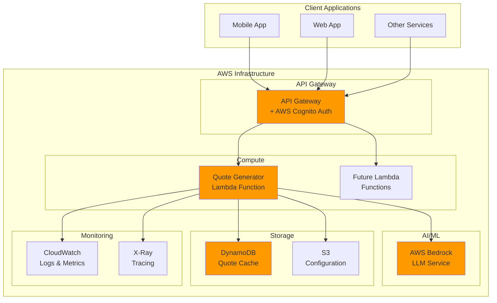
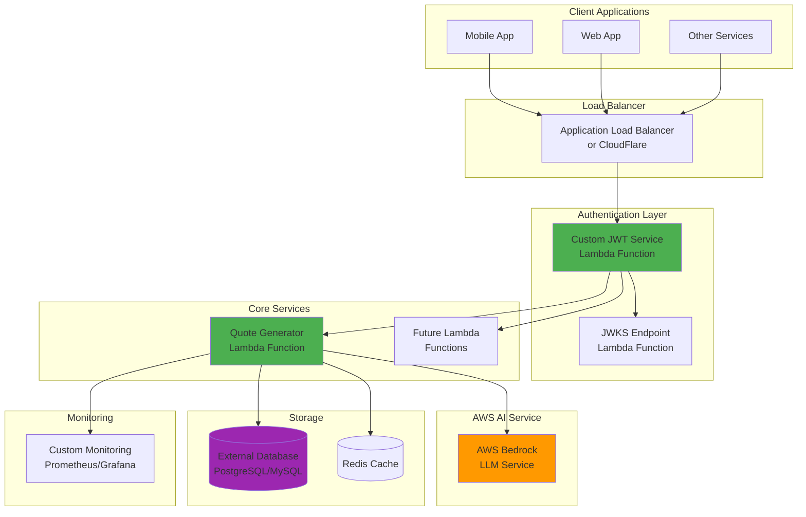

# Sloth Util

**AWS Lambda utilities for microservices** - A collection of reusable Lambda functions designed to provide common functionality across multiple applications.

## Overview

Sloth Util provides a suite of serverless utility functions deployed as AWS Lambda functions using Spring Boot Java. The functions are designed to be lightweight, reusable, and easily integrated into your existing microservices architecture.

### Current Features

- **Random Quote Generator**: Leverages AWS Bedrock LLM to generate inspirational, motivational, or contextual quotes on demand

### Planned Features

- Authentication utilities
- Data transformation functions
- Notification services
- File processing utilities

## Architecture

This project supports two deployment architectures to accommodate different organizational needs and requirements:

### Architecture 1: AWS-Native (Recommended)



**Benefits:**
- Fully managed authentication via AWS Cognito
- Seamless integration with AWS services
- Built-in monitoring and observability
- Cost-effective scaling
- Minimal operational overhead

### Architecture 2: Cloud-Agnostic with Custom JWT (Still uses AWS Bedrock)



**Benefits:**
- Avoids AWS networking services (API Gateway, VPC, etc.)
- Custom authentication flow control
- Still leverages AWS Bedrock for AI capabilities
- Flexible load balancing options
- Full control over security implementation
- Can use external databases and caching

## Technology Stack

- **Runtime**: Java 17+ with Spring Boot 3.x
- **Build Tool**: Maven
- **Deployment**: SST (Serverless Stack) v3
- **Infrastructure**: AWS Lambda
- **AI/ML**: AWS Bedrock (Claude/Titan models)
- **Database**: DynamoDB (AWS) / PostgreSQL (Cloud-agnostic)
- **Authentication**: AWS Cognito / Custom JWT

## Cost Analysis

### Traffic Scenarios

| Scenario | Requests/Month | Concurrent Users | Peak RPS |
|----------|----------------|------------------|----------|
| **Low** | 100K | 10-50 | 5 |
| **Medium** | 1M | 100-500 | 50 |
| **High** | 10M | 1K-5K | 500 |

### AWS-Native Architecture Costs

| Component | Low Traffic | Medium Traffic | High Traffic |
|-----------|-------------|----------------|--------------|
| **Lambda Invocations** | $0.20 | $2.00 | $20.00 |
| **Lambda Duration** (1GB, 500ms avg) | $0.83 | $8.33 | $83.33 |
| **API Gateway** | $0.35 | $3.50 | $35.00 |
| **AWS Cognito** | $0.00 | $5.50 | $55.00 |
| **AWS Bedrock** (Claude Instant) | $15.00 | $150.00 | $1,500.00 |
| **DynamoDB** (On-Demand) | $2.50 | $12.50 | $62.50 |
| **S3** (Config storage) | $0.25 | $0.50 | $2.50 |
| **CloudWatch Logs** | $0.50 | $2.50 | $12.50 |
| **X-Ray Tracing** | $0.50 | $5.00 | $50.00 |
| **Data Transfer** | $0.90 | $4.50 | $22.50 |
| **Total Monthly Cost** | **$21.03** | **$194.33** | **$1,843.33** |

### Cloud-Agnostic Architecture Costs

| Component | Low Traffic | Medium Traffic | High Traffic |
|-----------|-------------|----------------|--------------|
| **Lambda Invocations** | $0.20 | $2.00 | $20.00 |
| **Lambda Duration** (1GB, 500ms avg) | $0.83 | $8.33 | $83.33 |
| **Application Load Balancer** | $16.20 | $16.20 | $16.20 |
| **AWS Bedrock** (Claude Instant) | $15.00 | $150.00 | $1,500.00 |
| **External PostgreSQL** (managed) | $25.00 | $100.00 | $400.00 |
| **Redis Cache** (managed) | $15.00 | $60.00 | $240.00 |
| **CloudFlare Pro** (optional) | $20.00 | $20.00 | $20.00 |
| **Monitoring Stack** | $0.00 | $25.00 | $100.00 |
| **Data Transfer** | $0.90 | $5.40 | $27.00 |
| **Total Monthly Cost** | **$93.13** | **$386.93** | **$2,406.53** |

### Cost Comparison Summary

| Traffic Level | AWS-Native | Cloud-Agnostic | Difference |
|---------------|------------|----------------|------------|
| **Low** | $21.03 | $93.13 | +$72.10 (+343%) |
| **Medium** | $194.33 | $386.93 | +$192.60 (+99%) |
| **High** | $1,843.33 | $2,406.53 | +$563.20 (+31%) |

**Key Insights:**
- AWS-Native is significantly cheaper at low traffic volumes
- Cost difference decreases as traffic increases
- Cloud-agnostic provides more control but at higher base cost
- Both architectures scale cost-effectively with traffic

## Local Development Environment

### Prerequisites

- **Java 17+** (Amazon Corretto recommended)
- **Maven 3.8+**
- **Node.js 18+** (for SST)
- **Docker & Docker Compose** (for local services)
- **AWS CLI** configured with appropriate permissions
- **Go 1.19+** (for setup scripts)

### Local Setup

```bash
# Clone and setup project
git clone https://github.com/klawed/sloth-util.git
cd sloth-util

# Run the setup script to create directory structure
go run scripts/setup.go

# Install dependencies
npm install
mvn clean install

# Start local development environment
docker-compose up -d  # Starts local DynamoDB, Redis, PostgreSQL
npx sst dev          # Starts SST development mode
```

### Local Development Stack

```yaml
# docker-compose.yml services
services:
  - DynamoDB Local (port 8000)
  - PostgreSQL (port 5432)
  - Redis (port 6379)
  - LocalStack (AWS services simulation)
```

### Development Workflow

1. **Code Changes**: Edit Java functions in `packages/functions/`
2. **Hot Reload**: SST automatically rebuilds and redeploys on changes
3. **Local Testing**: Use local endpoints provided by `sst dev`
4. **Integration Tests**: Run against local Docker services
5. **Debug**: Attach debugger to running Lambda functions

### Environment Configuration

```bash
# .env.local (for local development)
STAGE=local
AWS_REGION=us-east-1
DYNAMODB_ENDPOINT=http://localhost:8000
POSTGRES_URL=postgresql://localhost:5432/slothutil
REDIS_URL=redis://localhost:6379
BEDROCK_MODEL_ID=anthropic.claude-instant-v1
LOG_LEVEL=DEBUG
```

## CI/CD Pipeline

### GitHub Actions Workflow

The project uses GitHub Actions for continuous integration and deployment:

```yaml
# .github/workflows/ci-cd.yml
name: CI/CD Pipeline
on:
  push:
    branches: [main, develop]
  pull_request:
    branches: [main]

jobs:
  test:
    runs-on: ubuntu-latest
    steps:
      - Unit Tests (Maven)
      - Integration Tests (TestContainers)
      - Security Scans (Snyk)
      - Code Quality (SonarCloud)
  
  deploy-dev:
    needs: test
    if: github.ref == 'refs/heads/develop'
    runs-on: ubuntu-latest
    steps:
      - Deploy to Development
      - Run E2E Tests
  
  deploy-prod:
    needs: test
    if: github.ref == 'refs/heads/main'
    runs-on: ubuntu-latest
    steps:
      - Deploy to Production
      - Run Smoke Tests
      - Update Documentation
```

### Deployment Stages

1. **Development** (`develop` branch)
   - Automatic deployment on push
   - Full test suite execution
   - Integration with external services
   - Performance baseline testing

2. **Production** (`main` branch)
   - Automatic deployment on push
   - Blue/green deployment strategy
   - Rollback capabilities
   - Comprehensive monitoring

### Required GitHub Secrets

```bash
AWS_ACCESS_KEY_ID          # AWS deployment credentials
AWS_SECRET_ACCESS_KEY      # AWS deployment credentials
BEDROCK_ROLE_ARN          # IAM role for Bedrock access
SONAR_TOKEN               # SonarCloud integration
SNYK_TOKEN                # Security scanning
DATABASE_PASSWORD         # For cloud-agnostic deployments
REDIS_PASSWORD            # For cloud-agnostic deployments
```

### Testing Strategy

```bash
# Unit Tests
mvn test

# Integration Tests (with TestContainers)
mvn verify -P integration-tests

# End-to-End Tests
npm run test:e2e

# Performance Tests
mvn test -P performance-tests

# Security Tests
npm run test:security
```

## Getting Started

### Quick Setup

```bash
# 1. Clone repository
git clone https://github.com/klawed/sloth-util.git
cd sloth-util

# 2. Setup project structure
go run scripts/setup.go

# 3. Install dependencies
npm install
mvn clean install

# 4. Configure environment
cp .env.example .env
# Edit .env with your configuration

# 5. Start local development
docker-compose up -d
npx sst dev

# 6. Deploy to development
npx sst deploy --stage dev
```

### Project Structure

```
sloth-util/
├── sst.config.ts              # SST configuration
├── docker-compose.yml         # Local development services
├── packages/
│   ├── functions/             # Lambda function code
│   │   ├── quote-generator/   # Quote generator service
│   │   │   ├── src/main/java/com/slothutil/quotes/
│   │   │   │   ├── QuoteHandler.java
│   │   │   │   ├── config/
│   │   │   │   ├── service/
│   │   │   │   └── model/
│   │   │   ├── src/test/java/
│   │   │   └── pom.xml
│   │   ├── auth-service/      # JWT authentication service
│   │   └── common/            # Shared utilities
│   ├── core/                  # Core business logic
│   └── infrastructure/        # SST stack definitions
├── scripts/
│   ├── setup.go              # Project setup script
│   ├── deploy.sh             # Deployment scripts
│   └── test.sh               # Testing scripts
├── .github/
│   └── workflows/
│       └── ci-cd.yml         # GitHub Actions pipeline
├── docs/                     # Additional documentation
└── tools/                    # Development tools and configs
```

## API Endpoints

### Quote Generator

**GET** `/quotes/random`

Generate a random inspirational quote using AI.

**Query Parameters:**
- `category` (optional): Category of quote (motivational, tech, business, life)
- `length` (optional): Preferred length (short, medium, long)
- `cache` (optional): Use cached quotes if available (default: true)

**Headers:**
- `Authorization: Bearer <jwt-token>` (for custom JWT auth)
- `Content-Type: application/json`

**Response:**
```json
{
  "quote": "The best way to predict the future is to create it.",
  "author": "AI Generated",
  "category": "motivational",
  "length": "short",
  "timestamp": "2025-05-23T19:18:03Z",
  "cached": false,
  "requestId": "req-123-456-789"
}
```

## Monitoring and Observability

### AWS-Native Architecture
- CloudWatch Logs and Metrics
- X-Ray distributed tracing
- Custom CloudWatch dashboards
- AWS Config for compliance

### Cloud-Agnostic Architecture
- Custom Prometheus metrics
- Grafana dashboards
- Structured logging with JSON format
- Custom health check endpoints
- Application performance monitoring

## Security

- JWT-based authentication (custom or AWS Cognito)
- Rate limiting per client/IP
- Input validation and sanitization
- Secrets managed securely (AWS Parameter Store or external)
- Regular security dependency updates
- OWASP compliance testing

## Contributing

1. Fork the repository
2. Create a feature branch (`git checkout -b feature/amazing-feature`)
3. Follow the coding standards (Checkstyle + SpotBugs)
4. Write tests for new functionality
5. Commit your changes (`git commit -m 'Add amazing feature'`)
6. Push to the branch (`git push origin feature/amazing-feature`)
7. Open a Pull Request

## License

This project is licensed under the MIT License - see the [LICENSE](LICENSE) file for details.

## Roadmap

- [x] Project setup and architecture design
- [ ] Quote Generator Lambda (v1.0)
- [ ] Custom JWT authentication service
- [ ] CI/CD pipeline implementation
- [ ] Monitoring and alerting setup
- [ ] Performance optimization
- [ ] Additional utility functions
- [ ] Multi-region deployment support

## Support

For support and questions:
- Create an issue in this repository
- Check the [documentation](docs/)
- Review existing issues and discussions

---

**Note**: This project is designed to be modular and extensible. Each Lambda function is independently deployable and can be used across different applications in your ecosystem.